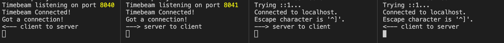

# Timebeam
> A TOTP constrained 1:1 secure tunnel built on hyperbeam



## Status: WIP
Timebeam is minimally viable level as of this version.

# Install
`npm i timebeam`

# Example
```js
const Timebeam = require('./server')

let timebeam = new Timebeam({
  secret: 'some super secret secret', 
  topic: 'some secure topic identifier',
  clientPort: 8040,
  serverPort: 8041
})

timebeam.on('connected', (timebeam)=>{
  console.log('Timebeam Connected!')
})
timebeam.on('close', ()=>{
  console.log('Timebeam closed')
})

// Simple terminal chat app
timebeam.on('data', data => {
  console.log(data)
})
process.stdout.on('data', data => {
  timebeam.send(data)
})

// Telnet to the client port to send messages to the server
// Telnet to the server port to send messages to the client
```